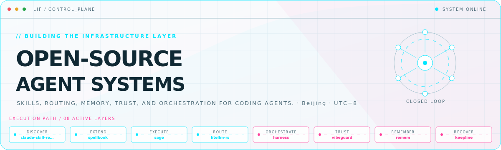
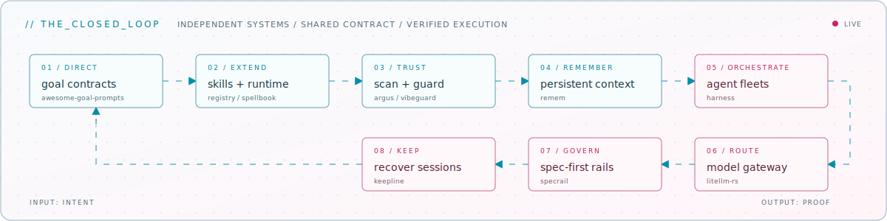

<picture>
  <source media="(prefers-color-scheme: dark)" srcset="assets/hero-dark.svg">
  <source media="(prefers-color-scheme: light)" srcset="assets/hero-light.svg">
  
</picture>

Skills, routing, memory, trust, and orchestration for coding agents\.

## Flagship systems

| Repository | Role | Purpose |
| --- | --- | --- |
| [`claude-skill-registry`](https://github.com/majiayu000/claude-skill-registry)  | DISCOVER | The largest searchable index for Claude Code skills, with daily updates and browser search\. |
| [`spellbook`](https://github.com/majiayu000/spellbook)  | EXTEND | Cross-runtime skills for Claude Code, Codex, and multi-agent workflows\. |
| [`litellm-rs`](https://github.com/majiayu000/litellm-rs)  | ROUTE | A Rust library and gateway for calling LLM APIs through an OpenAI-compatible format\. |
| [`harness`](https://github.com/majiayu000/harness)  | ORCHESTRATE | A Rust control plane for governed fleets of Claude Code and Codex agents\. |
| [`vibeguard`](https://github.com/majiayu000/vibeguard)  | TRUST | Native rules, real-time hooks, and static guards that catch unverified agent changes\. |
| [`sage`](https://github.com/majiayu000/sage)  | EXECUTE | A Rust-native open-source coding agent shipped as a single binary\. |

## Closed-loop architecture

<picture>
  <source media="(prefers-color-scheme: dark)" srcset="assets/closed-loop-dark.svg">
  <source media="(prefers-color-scheme: light)" srcset="assets/closed-loop-light.svg">
  
</picture>

## Module registry

<strong>Agent control loop</strong> · 6 modules

| Module | Purpose |
| --- | --- |
| [`remem`](https://github.com/majiayu000/remem) | Local-first persistent memory for Claude Code and Codex\. |
| [`specrail`](https://github.com/majiayu000/specrail) | Spec-first rails for agent-assisted repository workflows\. |
| [`keepline`](https://github.com/majiayu000/keepline) | A command center for monitoring and recovering local agent sessions\. |
| [`awesome-goal-prompts`](https://github.com/majiayu000/awesome-goal-prompts) | Source-backed goal contracts for coding agents\. |
| [`argus`](https://github.com/majiayu000/argus) | A Rust scanner for install-time package supply-chain risks\. |
| [`profile-control-plane`](https://github.com/majiayu000/profile-control-plane) | Compile a GitHub identity into an animated, self-hosted profile README\. |

<strong>Skill ecosystem</strong> · 6 modules

| Module | Purpose |
| --- | --- |
| [`claude-skill-registry-core`](https://github.com/majiayu000/claude-skill-registry-core) | Canonical workflows, deduplicated index, and search site for the skill registry\. |
| [`claude-skill-registry-data`](https://github.com/majiayu000/claude-skill-registry-data) | Raw archive data for the Claude skill registry\. |
| [`claude-skill-manager`](https://github.com/majiayu000/claude-skill-manager) | Discover, install, and manage Claude Code skills from the terminal\. |
| [`loom`](https://github.com/majiayu000/loom) | Skill registry and projection control plane for coding agents\. |
| [`refine`](https://github.com/majiayu000/refine) | Extract reusable knowledge from coding-agent conversations\. |
| [`chat-archive-rs`](https://github.com/majiayu000/chat-archive-rs) | Archive and search Claude Code and Codex sessions locally\. |

<strong>Rust systems</strong> · 6 modules

| Module | Purpose |
| --- | --- |
| [`rnk`](https://github.com/majiayu000/rnk) | Declarative TUI framework with React-like hooks and 45\+ components\. |
| [`rui`](https://github.com/majiayu000/rui) | GPU-accelerated UI framework inspired by GPUI\. |
| [`ccstats`](https://github.com/majiayu000/ccstats) | Fast Claude Code and Codex token and cost analytics CLI\. |
| [`jsonrepair-rs`](https://github.com/majiayu000/jsonrepair-rs) | Repair malformed JSON from LLM output\. |
| [`rekey`](https://github.com/majiayu000/rekey) | Credential-isolation proxy for agent API keys\. |
| [`rclean`](https://github.com/majiayu000/rclean) | Find and clean rebuildable developer artifacts\. |

<strong>Daily drivers</strong> · 6 modules

| Module | Purpose |
| --- | --- |
| [`quotabar`](https://github.com/majiayu000/quotabar) | macOS menu bar monitor for AI tool quotas and local usage cost\. |
| [`caff`](https://github.com/majiayu000/caff) | Keep macOS awake during long-running agent tasks\. |
| [`rss-scout`](https://github.com/majiayu000/rss-scout) | Zero-API discovery across 113\+ AI and developer feeds\. |
| [`techpulse`](https://github.com/majiayu000/techpulse) | Aggregate AI and tech news across major developer sources\. |
| [`stash`](https://github.com/majiayu000/stash) | Evidence-backed personal task inbox for coding-agent sessions\. |
| [`gh-mine`](https://github.com/majiayu000/gh-mine) | List your open GitHub issues and pull requests in one command\. |

<a href="https://github.com/majiayu000">GitHub</a> · <a href="https://silencestar.com">Blog</a> · <a href="mailto:mylifcc@gmail.com">Email</a>

<!-- Generated by profile-control-plane. Edit profile.yaml, not this file. -->
