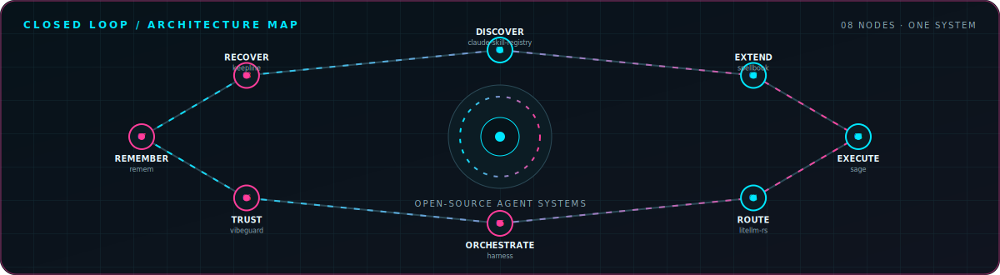

<picture>
  <source media="(prefers-color-scheme: dark)" srcset="./assets/hero-dark.svg">
  <source media="(prefers-color-scheme: light)" srcset="./assets/hero-light.svg">
  
</picture>

I build the infrastructure around coding agents: **skills, trust, memory, orchestration, routing, governance, and recovery.** 
Each project works alone. Together, they form a closed execution loop.

---

### `// THE_CLOSED_LOOP`

<picture>
  <source media="(prefers-color-scheme: dark)" srcset="./assets/closed-loop-dark.svg">
  <source media="(prefers-color-scheme: light)" srcset="./assets/closed-loop-light.svg">
  
</picture>

---

### `// FLAGSHIP_SYSTEMS`

<table>
  <tr>
    <td width="33%" valign="top">
      <code>EXTEND / 01</code>
      <h3><a href="https://github.com/majiayu000/claude-skill-registry">claude-skill-registry</a></h3>
      
The comprehensive discovery layer for Claude Code skills.

      
    </td>
    <td width="33%" valign="top">
      <code>EXTEND / 02</code>
      <h3><a href="https://github.com/majiayu000/spellbook">spellbook</a></h3>
      
Cross-runtime skills for Claude Code, Codex, and multi-agent workflows.

      
    </td>
    <td width="33%" valign="top">
      <code>ROUTE / 03</code>
      <h3><a href="https://github.com/majiayu000/litellm-rs">litellm-rs</a></h3>
      
High-performance Rust gateway for 100+ LLM APIs through one format.

      
    </td>
  </tr>
  <tr>
    <td width="33%" valign="top">
      <code>ORCHESTRATE / 04</code>
      <h3><a href="https://github.com/majiayu000/harness">harness</a></h3>
      
Governed fleets of parallel coding agents, powered by a Rust control plane.

      
    </td>
    <td width="33%" valign="top">
      <code>TRUST / 05</code>
      <h3><a href="https://github.com/majiayu000/vibeguard">vibeguard</a></h3>
      
Rules, hooks, and guards against hallucinated or unverified agent changes.

      
    </td>
    <td width="33%" valign="top">
      <code>REMEMBER / 06</code>
      <h3><a href="https://github.com/majiayu000/remem">remem</a></h3>
      
Local-first, auditable memory for long-running Claude Code and Codex work.

      
    </td>
  </tr>
</table>

<b><code>// OPEN_MODULE_BAY</code></b> — more systems, tools, and experiments

 

#### Core loop

| Project | Role |
|:--|:--|
| [`awesome-goal-prompts`](https://github.com/majiayu000/awesome-goal-prompts) | 114 source-backed `/goal` contracts for coding agents |
| [`argus`](https://github.com/majiayu000/argus) | Install-time supply-chain scanner for npm, PyPI, and crates.io |
| [`specrail`](https://github.com/majiayu000/specrail) | Spec-first rails for agent-assisted repository workflows |
| [`keepline`](https://github.com/majiayu000/keepline) | Session command center for monitoring and recovering agent work |

#### Rust systems

| Project | Role |
|:--|:--|
| [`sage`](https://github.com/majiayu000/sage) | Blazing-fast coding agent in pure Rust |
| [`rnk`](https://github.com/majiayu000/rnk) | Declarative TUI framework with React-like hooks and 45+ components |
| [`rui`](https://github.com/majiayu000/rui) | GPU-accelerated UI framework inspired by GPUI |
| [`ccstats`](https://github.com/majiayu000/ccstats) | Claude Code and Codex token/cost analytics CLI |
| [`jsonrepair-rs`](https://github.com/majiayu000/jsonrepair-rs) | Repair 30+ classes of malformed JSON from LLM output |
| [`rekey`](https://github.com/majiayu000/rekey) | Agent API-key routing and credential-isolation proxy |
| [`rclean`](https://github.com/majiayu000/rclean) | Find and clean rebuildable developer artifacts |

#### Agent tooling

| Project | Role |
|:--|:--|
| [`loom`](https://github.com/majiayu000/loom) | Skill registry and projection control plane |
| [`claude-skill-manager`](https://github.com/majiayu000/claude-skill-manager) | Discover, install, and manage Claude Code skills |
| [`claude-skill-registry-core`](https://github.com/majiayu000/claude-skill-registry-core) | Deduplicated registry artifacts and index |
| [`claude-skill-registry-data`](https://github.com/majiayu000/claude-skill-registry-data) | Raw skills archive data |
| [`auto-contributor`](https://github.com/majiayu000/auto-contributor) | Automated GitHub contribution workflow powered by Claude Code |
| [`cc-model-watch`](https://github.com/majiayu000/cc-model-watch) | Warn when Claude Code silently swaps the serving model |
| [`claude-code-anime-sounds`](https://github.com/majiayu000/claude-code-anime-sounds) | Anime-themed Claude Code hook sounds |

#### Memory, context, and repository operations

| Project | Role |
|:--|:--|
| [`refine`](https://github.com/majiayu000/refine) | Extract reusable knowledge from coding-agent conversations |
| [`chat-archive-rs`](https://github.com/majiayu000/chat-archive-rs) | Archive and search Claude Code and Codex sessions |
| [`stash`](https://github.com/majiayu000/stash) | Evidence-backed personal task inbox |
| [`open-source-repo-ledger`](https://github.com/majiayu000/open-source-repo-ledger) | Public repository-readiness ledger |
| [`shipwise`](https://github.com/majiayu000/shipwise) | Agent-facing open-source launch playbook |
| [`test-loop`](https://github.com/majiayu000/test-loop) | Language-agnostic drift detection and CI guardrails |
| [`seo-agent-suite`](https://github.com/majiayu000/seo-agent-suite) | Discoverability audits for Shipwise |

#### Daily drivers and experiments

| Project | Role |
|:--|:--|
| [`caff`](https://github.com/majiayu000/caff) | Keep macOS awake during long-running agent tasks |
| [`quotabar`](https://github.com/majiayu000/quotabar) | Claude and Codex quota monitor for the macOS menu bar |
| [`rss-scout`](https://github.com/majiayu000/rss-scout) | Zero-API AI/tech discovery across 113+ feeds |
| [`spaceview`](https://github.com/majiayu000/spaceview) | High-performance macOS disk analyzer with treemap visualization |
| [`techpulse`](https://github.com/majiayu000/techpulse) | Hacker News, Reddit, GitHub, RSS, and Lobsters aggregator |
| [`codia`](https://github.com/majiayu000/codia) | Web-based 3D AI companion with voice and emotion |
| [`gh-mine`](https://github.com/majiayu000/gh-mine) | List your open GitHub issues and pull requests in one command |
| [`mysterious-revival`](https://github.com/majiayu000/mysterious-revival) | Godot roguelike based on *Mysterious Revival* — WIP |
| [`werewolf-nakama`](https://github.com/majiayu000/werewolf-nakama) | Online multiplayer Werewolf with Nakama and React |

---

### `// OPEN_CHANNEL`

BEIJING · UTC+8 · USUALLY BUILDING SOMETHING THAT KEEPS AGENTS HONEST

