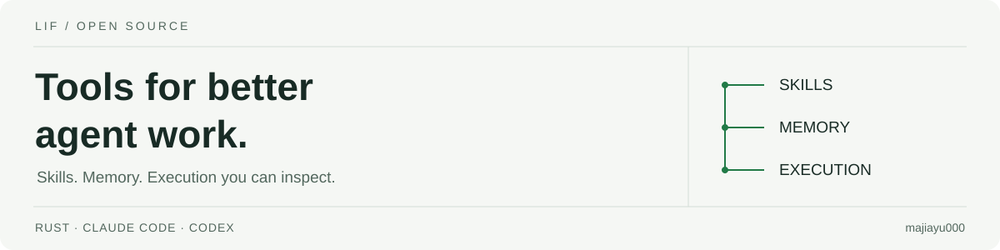

<picture>
  <source media="(prefers-color-scheme: dark)" srcset="./assets/hero-dark.svg">
  <source media="(prefers-color-scheme: light)" srcset="./assets/hero-light.svg">
  
</picture>

# Hi, I'm lif.

I build open-source tools around AI coding agents: **reusable skills, persistent memory, execution controls, and LLM infrastructure.** Most of my systems work is in Rust, with tools for Claude Code and Codex.

让 AI 编程更可控，让每一次工作留下可复用的经验。

[Projects](#selected-projects) · [Recent work](#recent-work) · [Writing](https://blog.silencestar.com/) · [Email](mailto:mylifcc@gmail.com)

## Selected projects

Six places to start, depending on what you need.

| If you want to… | Project | What it does |
| :--- | :--- | :--- |
| Find a skill for your next task | **[Claude Skills Registry](https://github.com/majiayu000/claude-skill-registry)** | Search and discover community Claude Code skills. [Browse the index ↗](https://majiayu000.github.io/claude-skill-registry-core/) |
| Reuse workflows across agents | **[Spellbook](https://github.com/majiayu000/spellbook)** | A skill library for Claude Code, Codex, and multi-agent workflows. |
| Keep context between sessions | **[remem](https://github.com/majiayu000/remem)** | Local-first engineering memory with source-attributed recall through hooks, MCP, and CLI. |
| Put controls around agent changes | **[VibeGuard](https://github.com/majiayu000/vibeguard)** | Native instructions, hooks, and static guards for agent-assisted repository work. |
| Coordinate multiple coding agents | **[Harness](https://github.com/majiayu000/harness)** | A Rust control plane for orchestration, policy, cross-agent review, and observability. |
| Run an LLM gateway | **[litellm-rs](https://github.com/majiayu000/litellm-rs)** | A self-hosted Rust gateway with an OpenAI-compatible API, routing, and provider integrations. |

## Recent work

My recent work extends that foundation into everyday tools and tighter execution boundaries.

- **Usage and cost:** [QuotaBar](https://github.com/majiayu000/quotabar) brings quota windows to the macOS menu bar; [ccstats](https://github.com/majiayu000/ccstats) turns local agent usage into token and cost reports.
- **Credentials and dependencies:** [Rekey](https://github.com/majiayu000/rekey) is an alpha local credential authority for fixed, capability-scoped actions; [Argus](https://github.com/majiayu000/argus) statically inspects package artifacts before install hooks run.
- **Desktop access:** [DSH Desk](https://github.com/majiayu000/dsh-desk) is a community desktop distribution of DeepSeek Harness, currently in alpha. [DSH Plugin Registry](https://github.com/majiayu000/dsh-plugin-registry) helps discover plugins.

<strong>More tools and experiments</strong>

| Area | Projects |
| :--- | :--- |
| Agent sessions and knowledge | [keepline](https://github.com/majiayu000/keepline) · [refine](https://github.com/majiayu000/refine) · [stash](https://github.com/majiayu000/stash) |
| Rust and terminal interfaces | [sage](https://github.com/majiayu000/sage) · [rnk](https://github.com/majiayu000/rnk) · [rclean](https://github.com/majiayu000/rclean) |
| Skills and task design | [loom](https://github.com/majiayu000/loom) · [awesome-goal-prompts](https://github.com/majiayu000/awesome-goal-prompts) |
| Exploration | [awesome-grok-bot](https://github.com/majiayu000/awesome-grok-bot) · [stealthprint](https://github.com/majiayu000/stealthprint) · [leidian](https://github.com/majiayu000/leidian) |

[All public repositories →](https://github.com/majiayu000?tab=repositories)

## Notes from building

I write about AI agents, implementation details, and lessons from these projects at **[Silent Star](https://blog.silencestar.com/)**, primarily in Chinese.

If you try a project, a reproducible issue or a small, focused pull request is a useful way to help. For a conversation, reach me at [mylifcc@gmail.com](mailto:mylifcc@gmail.com).

Beijing, China · Rust / Python / TypeScript · Building in public
